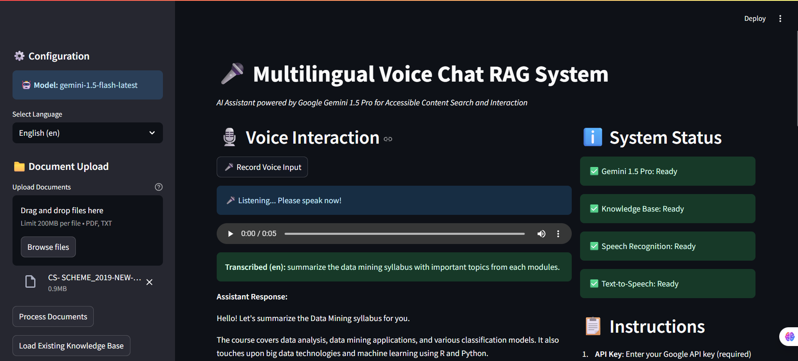
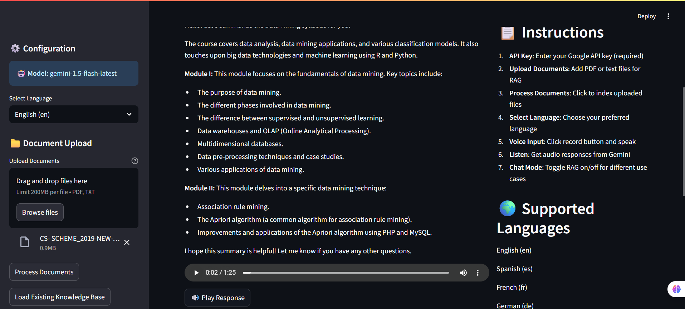

# 🎤 Multilingual Voice Chat RAG System

An accessible, multilingual AI assistant that combines Whisper, Gemini 1.5 Pro, sentence-transformer embeddings, and FAISS to allow visually impaired users to interact with document knowledge via voice. The system transcribes speech, retrieves relevant context from documents, generates empathetic answers using Gemini, and replies in speech.

---

## 📸 Screenshots

### 🧾 Upload & Transcibe Phase


### 🎙️ Multilingual Voice output Interface


---

## 📽️ Demo Video

[![Watch Demo]](https://drive.google.com/file/d/16DwGGjd67uY0tB_H_AZrwZdk1RfMyip9/view?usp=sharing)


---

## 📐 Architecture Overview

```mermaid
graph LR
  A[User (Voice Input)] --> B[Microphone Recording]
  B --> C[Whisper Speech-to-Text]
  C --> D{RAG or Direct?}
  D -->|RAG| E[Vector Store (FAISS)]
  E --> F[Contextual Document Retrieval]
  F --> G[Gemini 1.5 Pro QA Chain]
  D -->|Direct| H[Gemini 1.5 Pro Direct Prompt]
  G --> I[Text Response]
  H --> I
  I --> J[gTTS or pyttsx3 TTS]
  J --> K[Audio Output (pygame)]
```

## 🚀 Features
✅ Real-time voice input using speech_recognition

✅ Multilingual support with Whisper and gTTS

✅ PDF/Text document ingestion and vectorization

✅ RAG-based answer generation with Gemini 1.5 Pro

✅ Fallback direct generation when RAG is unavailable

✅ Audio playback using pygame

✅ Conversation history export

### 🧠 RAG Pipeline Implementation Notes
Text Ingestion

Supports .pdf and .txt documents.

Text is split into 1000-character chunks with 200-character overlap using RecursiveCharacterTextSplitter.

Embedding & Indexing

Uses sentence-transformers/all-MiniLM-L6-v2.

Chunks are embedded and stored in FAISS, serialized to disk.

Voice Input Pipeline

Audio recorded from mic (default 5s).

Transcription via Whisper with automatic or user-defined language.

Multilingual Prompt Template

Empathetic, audio-friendly format.

Response generation uses Gemini QA chain with prompt templating.

TTS Output

gTTS for accurate multilingual synthesis.

Fallback to pyttsx3 for unsupported languages.

## 📦 Tech Stack
Component	Tool/Library
STT	openai/whisper
TTS	gTTS, pyttsx3
Audio Input	speech_recognition + pydub
Audio Output	pygame
Vector Store	FAISS
Embeddings	sentence-transformers
LLM	gemini-1.5-flash-latest (Google Generative AI)
Interface	Streamlit

🛠 Setup Instructions
# 1. Clone the repo
bash 
```
git clone https://github.com/yourusername/multilingual-voice-rag.git
cd multilingual-voice-rag
```

# 2. Install dependencies
bash 
```
pip install -r requirements.txt
```
# 3. Add your Gemini API key
bash
```
echo "GOOGLE_API_KEY=your_key_here" > .env
```

# 4. Launch the app
bash 
```
streamlit run app.py
```
## 🌍 Supported Languages

| Code | Language   |
|------|------------|
| en   | English    |
| es   | Spanish    |
| fr   | French     |
| de   | German     |
| it   | Italian    |
| pt   | Portuguese |
| ru   | Russian    |
| ja   | Japanese   |
| ko   | Korean     |
| zh   | Chinese    |

